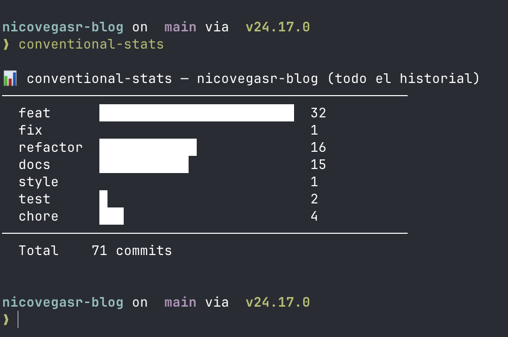

# conventional-stats


Un toolkit de shell minimalista para desarrolladores — haz commits más rápido con atajos de teclado y visualiza el historial de tus [Conventional Commits](https://www.conventionalcommits.org/) directamente desde la terminal.



---

## Por qué

La mayoría de desarrolladores ya siguen Conventional Commits — pero casi nadie los visualiza. `conventional-stats` te da dos cosas:

1. **Atajos de shell** que refuerzan la convención mientras escribes — `feat "añadir login"` → `git add . && git commit -m "feat: añadir login."`
2. **Una CLI** para auditar el historial de cualquier repo por tipo semántico, directamente desde la terminal

---

## Instalación

### Mac / Linux

```bash
git clone https://github.com/nicovegasr/conventional-stats
cd conventional-stats
./install.sh
source ~/.zshrc
```

### Windows (PowerShell)

```powershell
git clone https://github.com/nicovegasr/conventional-stats
cd conventional-stats
.\windows\install.ps1
```

> **Nota:** La CLI (`conventional-stats`) es un script zsh y no funciona de forma nativa en Windows. Usa WSL2 con zsh para acceder a ella. Los atajos de commit funcionan en PowerShell sin necesidad de WSL2.

---

## Atajos de shell

Cada función sigue el mismo patrón:

```
<tipo> "mensaje"  →  git add . && git commit -m "<tipo>: mensaje."
```

El punto final se añade automáticamente si falta. Los mensajes con varias palabras funcionan sin comillas: `feat añadir flujo de login`.

#### Flujo TDD

| Comando | Mensaje de commit |
|---------|------------------|
| `red "test de auth fallando"` | `red: test de auth fallando.` |
| `green "test de auth pasa"` | `green: test de auth pasa.` |
| `refactor "extraer helper de auth"` | `refactor: extraer helper de auth.` |

#### Conventional Commits

| Comando | Tipo | Cuándo usarlo |
|---------|------|---------------|
| `feat "añadir OAuth login"` | `feat` | Nueva funcionalidad |
| `fix "null check en logout"` | `fix` | Corrección de bug |
| `hotfix "parchear XSS en input"` | `hotfix` | Corrección urgente en producción |
| `docs "actualizar referencia API"` | `docs` | Documentación |
| `style "formatear controladores"` | `style` | Formato, sin cambio de lógica |
| `tests "cubrir casos borde"` | `test` | Tests añadidos o corregidos |
| `chore "actualizar dependencias"` | `chore` | Mantenimiento, tooling |
| `perf "cachear consultas BD"` | `perf` | Mejora de rendimiento |
| `ci "añadir paso de lint"` | `ci` | Configuración de CI/CD |
| `build "migrar a esbuild"` | `build` | Sistema de build |

Ejecuta `feat --help` (o cualquier tipo + `--help`) para ver la lista completa en tu terminal.

> **Revertir commits:** usa `git revert <hash>` directamente — git genera el mensaje convencional correcto de forma automática (`Revert "feat: ..."`), y `conventional-stats` lo contará en la categoría `revert`.

---

## CLI conventional-stats

Analiza cualquier repo git por tipo de commit:

```bash
# Directorio actual
conventional-stats

# Repo específico
conventional-stats ~/proyectos/mi-app

# Filtrar por rango de fechas
conventional-stats ~/proyectos/mi-app 90

# Salida JSON (pipeable a jq, scripts, etc.)
conventional-stats --json ~/proyectos/mi-app
conventional-stats --json ~/proyectos/mi-app 90
```

Formato de salida JSON:

```json
{
  "repo": "mi-app",
  "period": "últimos 90 días",
  "commits": [
    { "type": "feat", "count": 12 },
    { "type": "fix", "count": 8 }
  ],
  "total": 20
}
```

Funciona con cualquier repo que use Conventional Commits — el tuyo, el de un compañero o un proyecto open source.

---

## Cómo funciona

### Flujo de los atajos de shell

```
feat "añadir login"
  └─ _dispatch_commit "feat" "añadir login"
       └─ _execute_commit "feat" "añadir login."
            └─ git add . && git commit -m "feat: añadir login."
```

Tres capas: los comandos públicos fijan el tipo de commit y delegan en `_dispatch_commit`, que gestiona `--help` y los casos sin argumento, y llama a `_execute_commit` para la operación git real.

### Pipeline de datos de la CLI

```
conventional-stats ~/mi-app 90
  └─ git log --format="%s" --since="90 days ago"   (un único subproceso)
       └─ regex match por subject de commit          (en memoria, sin forks extra)
            └─ gráfico de barras proporcional → stdout
```

Un único `git log` lee todos los subjects; los conteos por tipo se construyen en un array asociativo. El ancho de las barras escala para que el tipo con más commits siempre ocupe la columna completa de 24 caracteres.

### Decisiones de diseño clave

| Decisión | Motivo |
|----------|--------|
| Un único `git log` para todos los tipos | Evita un subproceso por tipo (14 forks vs. 1) |
| `--since` almacenado como array | Previene word-splitting en `"30 days ago"` durante la expansión |
| Config copiada a `~/.config/conventional-stats/` | Mover o borrar el repo clonado no rompe la shell |
| Bloques marcados en `.zshrc` | `uninstall.sh` puede localizar y eliminar exactamente el bloque inyectado |
| CLI usa `#!/usr/bin/env zsh` | macOS incluye bash 3.2 (sin arrays asociativos); zsh viene integrado en Apple Silicon |
| Comando shell `tests` → prefijo de commit `test:` | Evita hacer shadowing del builtin `test` de zsh |

---

## Estructura del proyecto

```
conventional-stats/
├── bin/conventional-stats      # CLI: lee el historial git y renderiza el gráfico de barras
├── config/
│   ├── git-commits.zsh         # Atajos de commit incluidos en .zshrc (Unix/macOS)
│   └── git-commits.ps1         # Atajos de commit en el perfil PS (Windows)
├── tests/
│   └── conventional-stats.bats # Suite de tests BATS para la CLI
├── install.sh                  # Copia la CLI a ~/.local/bin, inyecta bloque en .zshrc
├── uninstall.sh                # Elimina la CLI, el directorio de config y el bloque de .zshrc
└── windows/
    └── install.ps1             # Inyecta git-commits.ps1 en el perfil de PowerShell
```

---

## Desinstalación

```bash
./uninstall.sh
source ~/.zshrc
```

Elimina el bloque añadido a tu `.zshrc`, el binario `conventional-stats` y el directorio de configuración. Se crea automáticamente una copia de seguridad en `.zshrc.bak`.

---

## Requisitos

| Herramienta | Mac | Linux | Windows |
|-------------|-----|-------|---------|
| zsh | integrado | `apt install zsh` | WSL2 |
| git | integrado | integrado | integrado |
| PowerShell 5+ | — | — | integrado |
