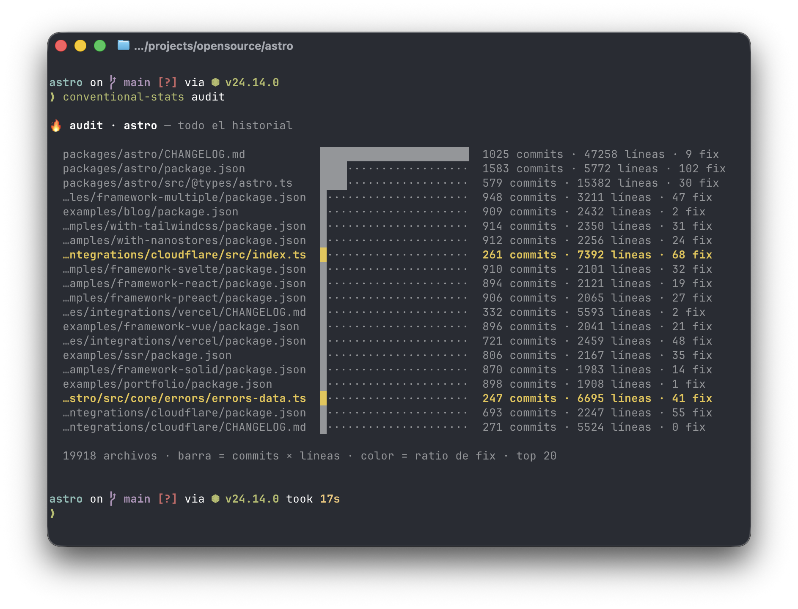
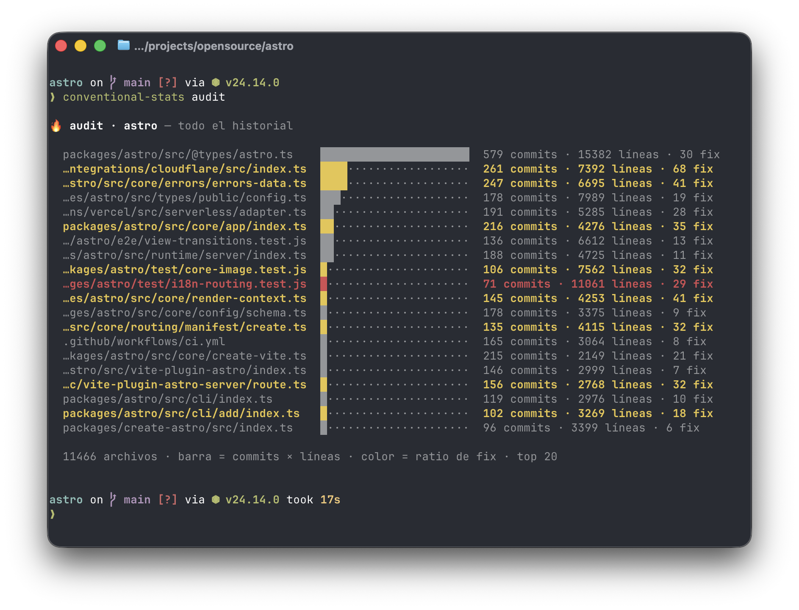
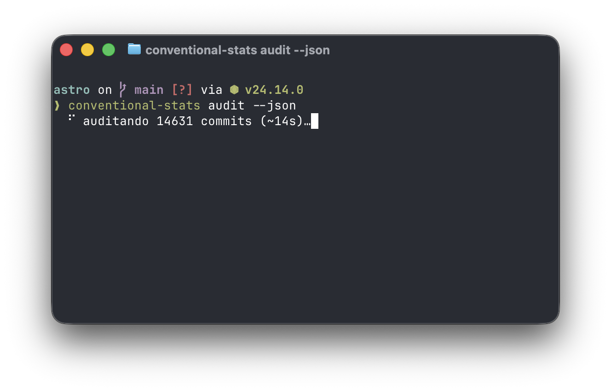
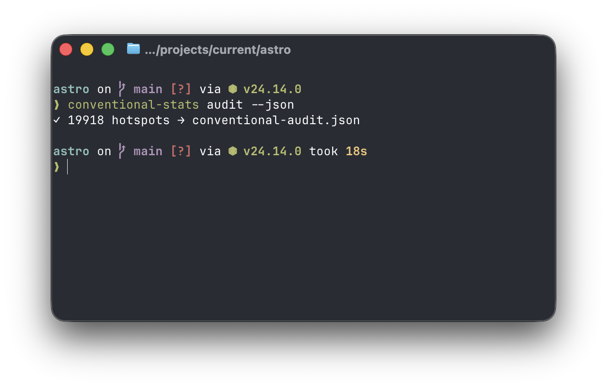

# conventional-stats


Un toolkit de shell minimalista para desarrolladores — haz commits más rápido con atajos de teclado y visualiza el historial de tus [Conventional Commits](https://www.conventionalcommits.org/) directamente desde la terminal.


---

## Instalación

### Mac / Linux

Un solo comando, sin clonar el repo:

```bash
/bin/bash -c "$(curl -fsSL https://raw.githubusercontent.com/nicovegasr/conventional-stats/main/install.sh)"
source ~/.zshrc
```

El instalador descarga la CLI a `~/.local/bin` y los atajos de commit a `~/.config/conventional-stats/`, y añade un bloque marcado a tu `.zshrc`. No deja nada más en tu sistema. Si prefieres clonar el repo, `./install.sh` funciona igual desde el clon local.

### Windows (PowerShell)

```powershell
git clone https://github.com/nicovegasr/conventional-stats
cd conventional-stats
.\windows\install.ps1
```

> **Nota:** La CLI (`conventional-stats`) es un script zsh y no funciona de forma nativa en Windows — usa WSL2 con zsh para acceder a ella. Los atajos de commit sí funcionan en PowerShell sin WSL2 y **se testean en CI** (Pester en windows-latest, PowerShell 5.1 y 7 — ver [docs/testing.md](docs/testing.md)).

---

## Desinstalación

```bash
/bin/bash -c "$(curl -fsSL https://raw.githubusercontent.com/nicovegasr/conventional-stats/main/uninstall.sh)"
source ~/.zshrc
```

Elimina el bloque añadido a tu `.zshrc` (con backup en `.zshrc.bak`), el binario `conventional-stats` y el directorio de configuración. Desde un clon local, `./uninstall.sh` hace lo mismo.

---

## Documentación

| Documento | Contenido |
|-----------|-----------|
| [docs/installation.md](docs/installation.md) | Requisitos, qué instala y dónde (esquema), y por qué cada decisión |
| [docs/cli.md](docs/cli.md) | La CLI `conventional-stats`: uso, salida JSON y cómo funciona por dentro |
| [docs/shortcuts.md](docs/shortcuts.md) | Los atajos de commit (`feat`, `fix`, …): uso, reglas y flujo interno |
| [docs/testing.md](docs/testing.md) | Qué se testea, cómo ejecutar los tests y el pipeline de CI |

---

## Qué te da

1. **Atajos de shell** que refuerzan Conventional Commits mientras escribes — `feat "añadir login"` → `git add . && git commit -m "feat: añadir login."`
2. **Una CLI** para auditar el historial de cualquier repo por tipo semántico, directamente desde la terminal.
3. **`audit`**: encuentra los archivos conflictivos (hotspots / code smells) por frecuencia y tamaño de cambio.

---

## Encuentra los archivos conflictivos — `conventional-stats audit`

`audit` ordena los archivos por **hotspot** (`commits × líneas modificadas`) para sacar a la luz los posibles code smells. Cada fila tiene dos dimensiones:

- **Barra = magnitud**: cuánto cambia y cuán grande es (un imán de cambios / posible god object).
- **Color = inestabilidad**: la proporción de commits `fix`/`hotfix`. Gris = estable; **amarillo** = se rompe a menudo; **rojo** = vive roto.

El truco está en **ignorar el ruido** (`CHANGELOG`, `package.json`, generados…) para que aflore el código real. Misma orden, antes y después de un `.auditignore`:

| Sin filtrar — el ruido tapa todo | Con `.auditignore` — afloran los hotspots |
|:---:|:---:|
|  |  |

A la derecha se lee de un vistazo: `@types/astro.ts` es el mayor imán de cambios pero está **en gris** (cambia mucho y es estable), mientras que `cloudflare/src/index.ts` y `errors-data.ts` salen en **amarillo/rojo** — cada vez que se tocan suele ser para arreglar algo. Esos son los candidatos a refactor.

```bash
conventional-stats audit                         # repo actual, todo el historial
conventional-stats audit --days 90               # últimos 90 días
conventional-stats audit --ignore '*.gradle'     # excluir puntualmente (glob/dir)
conventional-stats audit --init-ignore           # generar un .auditignore de plantilla
conventional-stats audit --set-ignore '*.md'     # recordar exclusiones en .auditignore
conventional-stats audit --json                  # informe completo → conventional-audit.json
conventional-stats audit --json | jq '.hotspots' # o por pipe, para filtrar al vuelo
```

En repos grandes recorrer el historial tarda unos segundos, así que muestra el progreso con el nº de commits y una estimación:



### Salida JSON a un archivo

`--json` devuelve el informe **completo** (sin truncar, con el desglose por tipo). Si lo rediriges o haces pipe (`| jq`, `> informe.json`) sale por stdout; si lo lanzas a pelo en la terminal, en vez de inundarla **escribe `conventional-audit.json`** (nombre con prefijo, fácil de añadir al `.gitignore`) y te confirma:



Más detalle en [docs/cli.md](docs/cli.md).
